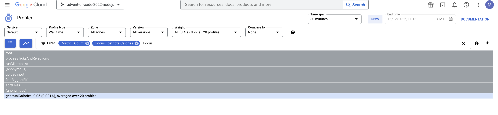

# Advent of Code, 2022, with nodejs on GCP

Advent of code is a coding challenge that runs every year.

This year though, I was inspired to solve the problem with live tracing and debugging and as much ops stuff as possible.

So I'll rely on the tools I know best, the amazing nestjs with typescript, GCP, and the super low overhead app engine.

This advent of code will be a tasty RESTful API, where you just upload your input, and the output arrives with some other summary stats.

It should have:
- good tests
- easy deployment
- nice logging
- live debugging and snapshotting
- tracing
- error reporting
- profiling

## What does it have?

### Debugging!

Without stopping or redeploying your running service, you can add a something akin to a breakpoint, called a snapshot, in this console. You can see what all the variables are, add your own expressions and see their values, see the callstack, and add simple logpoints.

### Tracing!

You can see the traces of how the sampled requests are routed through different services, and how long they take to be served.

### Profiling!(?)

You can profile your running application, which could help you down a path to finding memory leaks, doing memory footprint analysis, or poor garbage collection, effectively trying to find areas of inefficiency. However my very underutilised and straightforward API does not look very interesting.

## Interesting stuff I found so far

### You don't need to use GCP keys to authenticate with github actions.
Every github action can craft it's own token from github.
You can use this token, in conjunction with google's workload identity, to essentially verify that token, and map it's claims onto a new token.
Finally, we can restrict that token to only be allowable from certain repositories, owners, branches, etc...
No more long-lived tokens or uploading service account credentials as secrets.

Very interesting stuff, have a read [here](https://cloud.google.com/blog/products/identity-security/enabling-keyless-authentication-from-github-actions)

